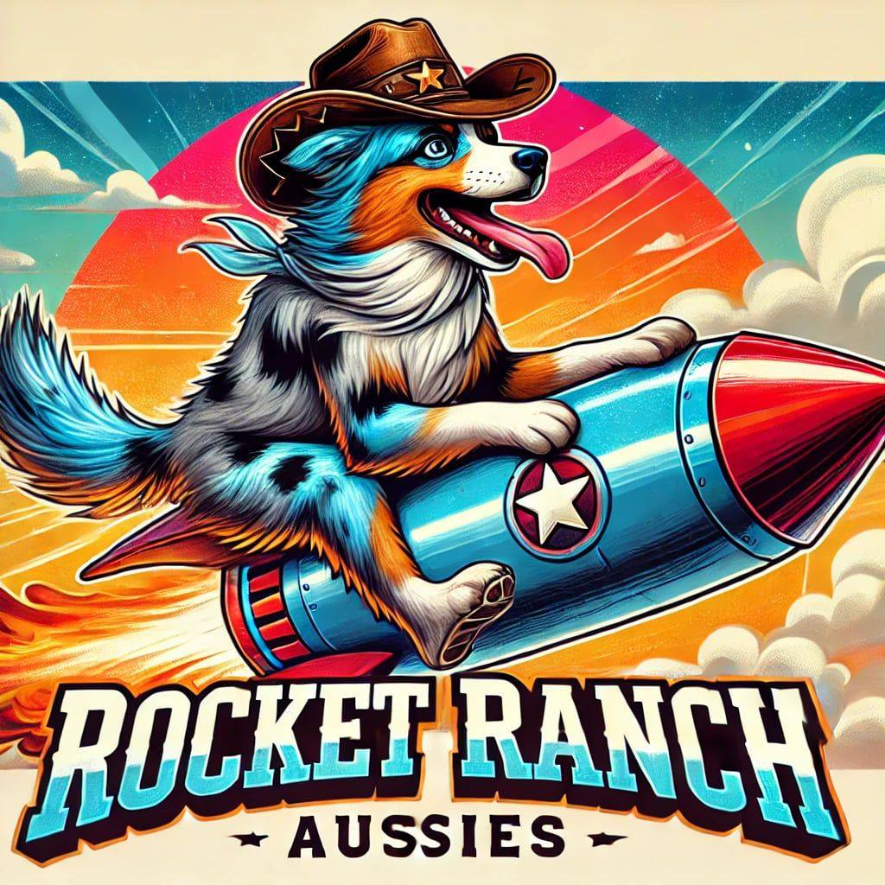

<html lang="en">
<head>
    <meta charset="UTF-8">
    <meta name="viewport" content="width=device-width, initial-scale=1.0">
    <title>Rocket Ranch Aussies</title>
    
</head>
<body>
    <header>

    </header>
    <nav>
        <a href="#home">Home</a>
        <a href="#puppies">Available Puppies</a>
        <a href="#about">About Us</a>
        <a href="#contact">Contact</a>
    </nav>
    
    <section id="home">
        <h1>Welcome to Rocket Ranch Aussies!</h1>
        
We are a family-run breeder located in Atlanta, TX, specializing in happy, well-socialized Miniature Australian Shepherds. Our puppies are raised with love and care to ensure they make the perfect companions.

    </section>
    
    <section id="puppies">
        <h2>Available Puppies</h2>
        

            
            
            
            
            
Our current litter is looking for their forever homes! Contact us for more details on available puppies and upcoming litters.

        

    </section>
    
    <section id="about">
        <h2>About Us</h2>
        
At Rocket Ranch Aussies, we absolutely love the Mini Aussie breed and are passionate about raising well-rounded puppies. We focus on early potty training, crate training, and socialization to help prepare each puppy for their forever home. Our goal is to provide loving companions who are ready to integrate smoothly into their new families.

    </section>
    
    <section id="contact">
        <h2>Contact Us</h2>
        

            <form action="https://formspree.io/f/YOUR_UNIQUE_CODE" method="POST">
                <input type="text" name="name" placeholder="Your Name" required>
                <input type="email" name="email" placeholder="Your Email" required>
                <textarea name="message" placeholder="Your Message" rows="4" required></textarea>
                <button type="submit">Send Message</button>
            </form>
        

    </section>
</body>
</html>
**
